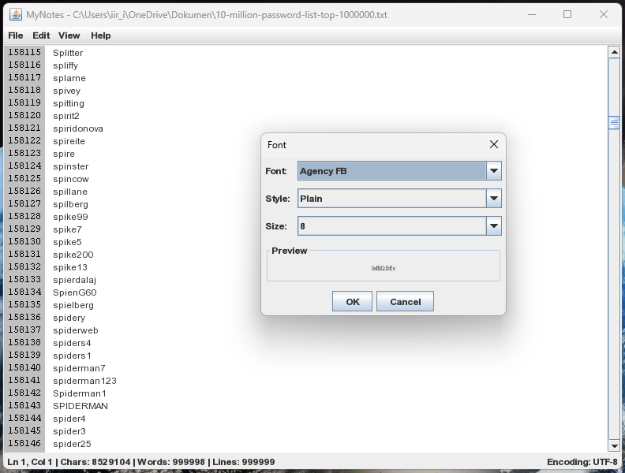

# MyNotes

[](https://www.java.com)
[](LICENSE)
[]()
[](https://netbeans.apache.org)

---
<p align="center">
  
</p>

MyNotes is a lightweight, cross-platform notepad-like text editor built in Java using the Swing framework. Designed for educational purposes, this project demonstrates the core functionality of a desktop text editor with modern features such as undo/redo, line numbering, word wrap, splash screen, and user-friendly help/about dialogs.

---

## 🎯 Purpose / Goal

The purpose of this project is to:
- Serve as a school project demonstrating desktop UI application development in Java.
- Provide a functional and extensible text editing tool.
- Showcase professional-grade user experience with splash screen, status bar, and interactive menu.

---

## ✨ Features

- ✅ **Open / Save / Save As / Print**
- 🔁 **Undo / Redo** with full menu and context menu support
- 📋 **Cut / Copy / Paste / Delete** operations via Edit menu or right-click
- 🔍 **Find**, **Find and Replace**, and **Go To Line** features
- 🔠 **Font customization** for editor text
- 🔢 **Line numbering** (supports real line count even with word wrap)
- 🌐 **Word Wrap toggle** with dynamic scrollbar adjustment
- 📌 **Status Bar** showing line, column, words, characters, and total lines
- 💬 **Help dialog** with topic navigation and usage instructions
- 🧾 **About dialog** with project info, license, and developer photo
- 🖼️ **Splash Screen** (Office 2000 style) with version label and branding
- 📂 **Cross-platform support** (Windows/Linux/macOS) using Java Swing

---

## 🛠 How to Build (NetBeans Instructions)

1. Open NetBeans IDE.
2. Click **File > Open Project...**
3. Navigate to the directory where the MyNotes source folder is located.
4. Select the root folder of the project (which includes `src/` and `nbproject/`).
5. Click **Open Project**.
6. Press **F6** or click **Run > Run Project** to launch.

📝 Make sure `me.png` is placed in the root directory for About and Splash screen to show your photo correctly.

---

## 📄 License

This project is licensed under the MIT License:

```
MIT License

Copyright (c) 2025 Muhammad Irfan Luthfi

Permission is hereby granted, free of charge, to any person obtaining a copy
of this software and associated documentation files (the "Software"), to deal
in the Software without restriction, including without limitation the rights
to use, copy, modify, merge, publish, distribute, sublicense, and/or sell
copies of the Software, and to permit persons to whom the Software is
furnished to do so, subject to the following conditions:

The above copyright notice and this permission notice shall be included in all
copies or substantial portions of the Software.

THE SOFTWARE IS PROVIDED "AS IS", WITHOUT WARRANTY OF ANY KIND, EXPRESS OR
IMPLIED, INCLUDING BUT NOT LIMITED TO THE WARRANTIES OF MERCHANTABILITY,
FITNESS FOR A PARTICULAR PURPOSE AND NONINFRINGEMENT. IN NO EVENT SHALL THE
AUTHORS OR COPYRIGHT HOLDERS BE LIABLE FOR ANY CLAIM, DAMAGES OR OTHER
LIABILITY, WHETHER IN AN ACTION OF CONTRACT, TORT OR OTHERWISE, ARISING FROM,
OUT OF OR IN CONNECTION WITH THE SOFTWARE OR THE USE OR OTHER DEALINGS IN THE
SOFTWARE.
```

---

## 💬 Questions? Suggestions?

Feel free to reach out to:

**Muhammad Irfan Luthfi**  
📧 iir_irfan02@hotmail.com  
🔗 [github.com/milstrike](https://github.com/milstrike)

---
